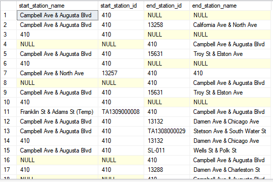
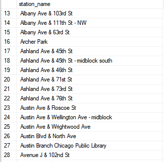
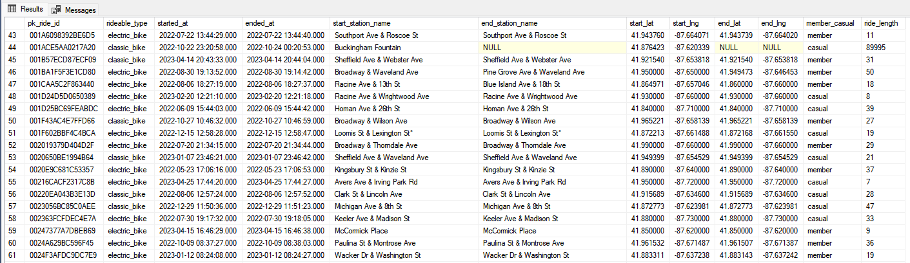

  

---

# Google Data Analytics Capstone Project : How Does a Bike-Share Navigate Speedy Success?

<p align="center"></p>

---

This is an optional capstone project for [Google Data Analytics Professional Certificate](https://www.coursera.org/professional-certificates/google-data-analytics) course at Coursera. I finished the first version of this project on May 13, 2023, and decided to do some revisions. In my previous analysis, I decided to drop all the rides without station names and make a lot of assumptions. This time, I tried to fill in those missing values using the station dataset I've gathered and also looked into Divvy (the source of datasets) itself to answer my business questions. Thank you for your interest in this case study, and feel free to share your comments and thoughts about my analysis. The following is the step-by-step process I've undertaken by following the six phases of data analysis taught at the course, which are: 1) ask, 2) prepare, 3) process, 4) analyze, 5) share, and 6) act.

---

## :question: ASK
In this phase, we would define the problem(s) and business objective(s), as well as identify the key stakeholders.

### Background
In 2016, Cyclistic launched a successful bike-share offering. Since then, the program has grown to a fleet of 5,824 bicycles that are geotracked and locked into a network of 692 stations across Chicago. The bikes can be unlocked from one station and returned to any other station in the system anytime.<br>

Until now, Cyclistic’s marketing strategy relied on building general awareness and appealing to broad consumer segments. One approach that helped make these things possible was the flexibility of its pricing plans: single-ride passes, full-day passes, and annual memberships. Customers who purchase single-ride or full-day passes are referred to as casual riders. Customers who purchase annual memberships are Cyclistic members.<br>

Cyclistic’s finance analysts have concluded that annual members are much more profitable than casual riders. Although the pricing flexibility helps Cyclistic attract more customers, Moreno believes that maximizing the number of annual members will be key to future growth. Rather than creating a marketing campaign that targets all-new customers, Moreno believes there is a very good chance to convert casual riders into members. She notes that casual riders are already aware of the Cyclistic program and have chosen Cyclistic for their mobility needs.<br>

### Key Stakeholders
1) Lily Moreno: The director of marketing and responsible for the development of campaigns and initiatives to promote the bike-share program through email, social media, and other channels.<br>
  
2) Cyclistic executive team: The team that will decide whether to approve the recommended marketing program.<br>

3) Cyclistic marketing analytics team: A team of data analysts who are responsible for collecting, analyzing, and reporting data that helps guide Cyclistic marketing strategy.<br>


### Business task
Identify ride patterns to help us understand the difference between members and casual users, which will aid in designing a marketing strategy that aims to convert casual riders into members.

### Deliverables
1. A clear statement of the business task<br>
2. A description of all data sources used<br>
3. Documentation of any cleaning or manipulation of data<br>
4. A summary of your analysis<br>
5. Supporting visualizations and key findings<br>
6. Your top recommendations based on your analysis<br>

---

## :open_file_folder: PREPARE
In this phase, we will identify data that is relevant to our analysis. Subsequently, we will describe our data sources, evaluate their credibility and integrity, and check for bias and their limitations.

### Data Information
Given that Cyclistic is a fictional company, we will be using the data that has been made available by Motivate International Inc. (acquired by Lyft in 2018) under this [license](https://ride.divvybikes.com/data-license-agreement).

#### Historical Trip Data

1) Data is publicly available and stored in the cloud in zip format, and within is a comma-separated value file.
2) Divvy system data (first-party data) is owned by the City of Chicago and released on a monthly schedule.
3) The data is also processed to remove trips that are taken by staff as they service and inspect the system.
4) Each ride data is anonymized.
5) Data is organized in a structured format and each data set contains the following attributes:<br>
•	ride_id – unique identifier for each ride, the ID of each ride<br>
•	rideable_type – type of bike that is categorized into three: classic bike, docked bike, and electric bike.<br>
•	started_at – the start date and time of the ride<br>
•	ended_at – the end date and time of the ride<br>
•	start_station_name – name of the start bike station<br>
•	start_station_id – the ID of the start bike station<br>
•	end_station_name - name of the end bike station<br>
•	end_station_id - the ID of the end bike station<br>
•	start_lat – the latitude of the start bike station<br>
•	start_lng – the longitude of the start bike station<br>
•	end_lat - the latitude of the end bike station<br>
•	end_lng - the longitude of the end bike station<br>
•	member_casual – denotes whether a rider is a casual rider or a member.<br>

#### Bike Stations Data

1) Data is publicly available and can be gathered from the live JSON feed available on the company's website.
2) Bike stations data is updated regularly.
3) Data is organized in a semi-structured format and contains the following attributes:<br>
• station_id -  the ID of the bike station<br>
• short_name - short name of station id, it matches the start_station_id and end_station_id of the historical trip data<br>
• legacy_id - the legacy ID of the bike station<br>
• name - station name<br>
• lat - the latitude of the bike station<br>
• lng - the longitude of the bike station<br>

### ROCCC Verification
ROCCC which stands for R-eliable, O-riginal, C-omprehensive, C-urrent and C-ited is a system we’ll use to check whether we have a good data source(s). <br>
&#x2713;	Reliable – data are accurate and shows no trace of bias since it consists of all the ride data for each month as well as stations data but incomplete due to the number of missing values - (MODERATE)<br>
&#x2713;	Original –  first-party data collected from Divvy system data - (HIGH)<br>
&#x2713;	Comprehensive – Overall, moderate because trip data lacks demographic data and maybe even just rider_id that could be helpful for us to determine whether each ride is associated with a single rider or not. - (MODERATE)<br>
&#x2713;	Current – the data are updated monthly and regularly by the company - (HIGH)<br>
&#x2713; 	Cited – data are directly provided by Divvy and owned by the City of Chicago as a means of supporting bicycling as an alternative transportation option- (HIGH)<br>

### Data Integrity
We will ensure the integrity of data by performing different data cleaning processes, such as data inspection, duplicates removal, filling up missing and null data, ensuring data type consistency, fixing and handling structural errors, and removing invalid values.

### Relevance of the datasets to the business task
The datasets are appropriate and enough for us to answer the business task since they contain ride data from both members and casual riders. By analyzing these datasets properly, we can extract insights from them that will help us understand how both riders use the company's service differently, which is the main goal of this analysis. 


### Data Limitations and Problems

1) Due to data privacy issues, it prohibits us from using riders’ personally identifiable information. This means that we won’t be able to connect pass purchases to credit card numbers to determine if casual riders live in the Cyclistic service area or if they have purchased multiple single passes.
2) We won’t also determine whether rides are done by the same rider, given that the only connection we can make is whether each ride is done by a casual rider or a member.
3) For this analysis, we will only analyze historical trip data from May 2022 to April 2023.
4) The dataset has missing values, swapped dates, inconsistent data, and lacks demographic information and even user IDs that would be really helpful in our analysis. 

---

## :shower: PROCESS

In this phase, we will perform different cleaning and transformation procedures using any data analysis tools to ensure data integrity. 

### Data Analysis Tool
I am using Microsft SQL Server as database technology to store the data in database tables and perform SQL queries. 

### Creating database and storing the datasets into tables

<details>
  <summary>Show SQL query</summary>
  
```tsql
-- Creating database 'dbTrip' if it doesn't exist
IF NOT EXISTS(
		SELECT *
		FROM sys.databases
		WHERE name = 'dbTrip'
	     )
CREATE DATABASE dbTrip;

-- Specifying the database 'dbTrip' we want to use
USE dbTrip;

-- Create table that will hold all the trips data
-- I'll be using six decimal places for longitude and latitude for accuracy.
CREATE TABLE tblTrips
(
	pk_ride_id VARCHAR(16) PRIMARY KEY NOT NULL,
	rideable_type VARCHAR(13),
	started_at DATETIME,
	ended_at DATETIME,
	start_station_name VARCHAR(100),
	start_station_id VARCHAR(50),
	end_station_name VARCHAR(100),
	end_station_id VARCHAR(50),
	start_lat DECIMAL(8,6),
	start_lng DECIMAL(9,6),
	end_lat DECIMAL(8,6),
	end_lng DECIMAL(9,6),
	member_casual VARCHAR(6)
);

--- Insert all the data from the .csv file into our database table 'tblTrips' for each month
BULK INSERT tblTrips
FROM 'D:\Cyclistic_Data_Analysis\Divvy_Datasets\BikeShareRide202205.csv'
WITH (
		FORMAT = 'CSV',
		FIELDTERMINATOR = ',',
		ROWTERMINATOR = '\n',
		FIRSTROW = 2			
	);

BULK INSERT tblTrips
FROM 'D:\Cyclistic_Data_Analysis\Divvy_Datasets\BikeShareRide202206.csv'
WITH (
		FORMAT = 'CSV',
		FIELDTERMINATOR = ',',
		ROWTERMINATOR = '\n',
		FIRSTROW = 2			
	);

BULK INSERT tblTrips
FROM 'D:\Cyclistic_Data_Analysis\Divvy_Datasets\BikeShareRide202207.csv'
WITH (
		FORMAT = 'CSV',
		FIELDTERMINATOR = ',',
		ROWTERMINATOR = '\n',
		FIRSTROW = 2			
	);

BULK INSERT tblTrips
FROM 'D:\Cyclistic_Data_Analysis\Divvy_Datasets\BikeShareRide202208.csv'
WITH (
		FORMAT = 'CSV',
		FIELDTERMINATOR = ',',
		ROWTERMINATOR = '\n',
		FIRSTROW = 2			
	);

BULK INSERT tblTrips
FROM 'D:\Cyclistic_Data_Analysis\Divvy_Datasets\BikeShareRide202209.csv'
WITH (
		FORMAT = 'CSV',
		FIELDTERMINATOR = ',',
		ROWTERMINATOR = '\n',
		FIRSTROW = 2			
	);

BULK INSERT tblTrips
FROM 'D:\Cyclistic_Data_Analysis\Divvy_Datasets\BikeShareRide202210.csv'
WITH (
		FORMAT = 'CSV',
		FIELDTERMINATOR = ',',
		ROWTERMINATOR = '\n',
		FIRSTROW = 2			
	);

BULK INSERT tblTrips
FROM 'D:\Cyclistic_Data_Analysis\Divvy_Datasets\BikeShareRide202211.csv'
WITH (
		FORMAT = 'CSV',
		FIELDTERMINATOR = ',',
		ROWTERMINATOR = '\n',
		FIRSTROW = 2			
	);

BULK INSERT tblTrips
FROM 'D:\Cyclistic_Data_Analysis\Divvy_Datasets\BikeShareRide202212.csv'
WITH (
		FORMAT = 'CSV',
		FIELDTERMINATOR = ',',
		ROWTERMINATOR = '\n',
		FIRSTROW = 2			
	);

BULK INSERT tblTrips
FROM 'D:\Cyclistic_Data_Analysis\Divvy_Datasets\BikeShareRide202301.csv'
WITH (
		FORMAT = 'CSV',
		FIELDTERMINATOR = ',',
		ROWTERMINATOR = '\n',
		FIRSTROW = 2			
	);

BULK INSERT tblTrips
FROM 'D:\Cyclistic_Data_Analysis\Divvy_Datasets\BikeShareRide202302.csv'
WITH (
		FORMAT = 'CSV',
		FIELDTERMINATOR = ',',
		ROWTERMINATOR = '\n',
		FIRSTROW = 2			
	);

BULK INSERT tblTrips
FROM 'D:\Cyclistic_Data_Analysis\Divvy_Datasets\BikeShareRide202303.csv'
WITH (
		FORMAT = 'CSV',
		FIELDTERMINATOR = ',',
		ROWTERMINATOR = '\n',
		FIRSTROW = 2			
	);

BULK INSERT tblTrips
FROM 'D:\Cyclistic_Data_Analysis\Divvy_Datasets\BikeShareRide202304.csv'
WITH (
		FORMAT = 'CSV',
		FIELDTERMINATOR = ',',
		ROWTERMINATOR = '\n',
		FIRSTROW = 2			
	);

/* Count the number of records to check whether we imported the right number of records from the 12 csv files.
It should be 5,859,061 */
SELECT
	COUNT(*) AS num_of_records
FROM tblTrips;

-- Create a table that will hold the station data.
CREATE TABLE tblStations
(
	station_id VARCHAR(100),
	short_name VARCHAR(50),
	legacy_id VARCHAR(50),
	station_name VARCHAR(100),
	lat DECIMAL(8,6),
	lng DECIMAL(9,6)
)

-- Insert all the data from the .csv file into our database table 'tblStations'
BULK INSERT tblStations
FROM 'D:\Cyclistic_Data_Analysis\Divvy_Datasets\divvy_stations.csv'
WITH (
	FORMAT = 'CSV',
    FIELDTERMINATOR = ',',
    ROWTERMINATOR = '\n',
    FIRSTROW = 2
);

-- Count the number of records to check whether we imported the right number of records from the csv file.
-- It should be 1,623.
SELECT
	COUNT(*) AS num_of_records 
FROM tblStations
```
</details>
tblTrips which contains the historical trip data

tblStations which contains bike stations data<br>


### Making a database backup
<details>
  <summary>Show SQL query</summary>
	
```tsql
-- Create a backup before we make any changes to our database
BACKUP DATABASE dbTrip TO DISK = 'D:\Cyclistic_Data_Analysis\Trip.bak';
```
</details>

### Data Inspection

#### Check for duplicate records
<details>
  <summary>Show SQL query</summary>
	
```tsql
-- Check for duplicate records on tblTrips
SELECT
	pk_ride_id,
	COUNT(pk_ride_id) AS count
FROM tblTrips
GROUP BY pk_ride_id
HAVING COUNT(pk_ride_id) > 1;

-- Check for duplicate records on tblStations
SELECT
	station_id,
	COUNT(station_id) AS count
FROM tblStations
GROUP BY station_id
HAVING COUNT(station_id) > 1;
```
</details>
No duplicates were found in the tblTrips and tblStations tables.


#### Check for invalid values
<details>
  <summary>Show SQL query</summary>
	
```tsql
-- Check columns if there is invalid value
SELECT DISTINCT 
		rideable_type
FROM tblTrips;

SELECT DISTINCT 
		member_casual 
FROM tblTrips;

-- Since the pk_ride_id is formatted as 16 alphanumeric characters, we should check the max and min lengths to check whether there is an invalid id.
SELECT 
	MAX(LEN(pk_ride_id)) AS max_length, 
	MIN(LEN(pk_ride_id)) AS min_length	   
FROM tblTrips;
```
</details>
No invalid values were found on columns rideable_type, member_casual and pk_ride_id.


#### Check for null or N/A values
<details>
  <summary>Show SQL query</summary>
	
```tsql
-- Check all our columns for N/A or NULL values.
SELECT
	COUNT (*) AS total_records,
	COUNT (CASE WHEN pk_ride_id IS NULL OR pk_ride_id = 'NA' OR pk_ride_id = 'N/A' OR LEN(pk_ride_id) = 0 THEN 1 END) AS ride_id,
	COUNT (CASE WHEN rideable_type IS NULL OR rideable_type = 'NA' OR rideable_type = 'N/A' OR LEN(rideable_type) = 0 THEN 1 END) AS rideable_type,
	COUNT (CASE WHEN started_at IS NULL OR ISDATE(started_at) = 0 THEN 1 END) AS started_at,
	COUNT (CASE WHEN ended_at IS NULL OR ISDATE(ended_at) = 0  THEN 1 END) AS ended_at,
	COUNT (CASE WHEN start_station_name IS NULL OR start_station_name = 'NA' OR start_station_name = 'N/A' OR LEN(start_station_name) = 0 THEN 1 END) AS start_station_name,
	COUNT (CASE WHEN start_station_id IS NULL OR start_station_id = 'NA' OR start_station_id = 'N/A' OR LEN(start_station_id) = 0 THEN 1 END) AS start_station_id,
	COUNT (CASE WHEN end_station_name IS NULL OR end_station_name = 'NA' OR end_station_name = 'N/A' OR LEN(end_station_name) = 0  THEN 1 END) AS end_station_name,
	COUNT (CASE WHEN end_station_id IS NULL OR end_station_id = 'NA' OR end_station_id = 'N/A' OR LEN(end_station_id) = 0 THEN 1 END) AS end_station_id,
	COUNT (CASE WHEN start_lat IS NULL THEN 1 END) AS start_lat,
	COUNT (CASE WHEN start_lng IS NULL THEN 1 END) AS start_lng,
	COUNT (CASE WHEN end_lat IS NULL THEN 1 END) AS end_lat,
	COUNT (CASE WHEN end_lng IS NULL THEN 1 END) AS end_lng,
	COUNT (CASE WHEN member_casual IS NULL OR member_casual = 'NA' OR member_casual = 'N/A' OR LEN(member_casual) = 0 THEN 1 END) AS member_casual
FROM tblTrips;
```
</details>
There are null values for columns start_station_name, start_station_id, end_station_name, end_station_id, end_lat and end_lng


### Data Cleaning

#### Remove the leading and trailing spaces for fields with string data types.
<details>
  <summary>Show SQL query for table tblTrips</summary>
	
```tsql
UPDATE tblTrips
SET pk_ride_id = TRIM(pk_ride_id);

UPDATE tblTrips
SET rideable_type = TRIM(rideable_type);

UPDATE tblTrips
SET member_casual = TRIM(member_casual);

UPDATE tblTrips
SET start_station_name = TRIM(start_station_name)
WHERE start_station_name IS NOT NULL;

UPDATE tblTrips
SET start_station_id = TRIM(start_station_id)
WHERE start_station_id IS NOT NULL;

UPDATE tblTrips
SET end_station_name = TRIM(end_station_name)
WHERE end_station_name IS NOT NULL;

UPDATE tblTrips
SET end_station_id = TRIM(end_station_id)
WHERE end_station_id IS NOT NULL;
```
</details>

<details>
  <summary>Show SQL query for table tblStations</summary>
	
```tsql
UPDATE tblStations
SET station_id = TRIM(station_id)

UPDATE tblStations
SET short_name = TRIM(short_name)

UPDATE tblStations
SET legacy_id = TRIM(legacy_id)

UPDATE tblStations
SET station_name = TRIM(station_name)
```
</details>

#### Cleaning station-related columns
We must first inspect start station names, end station names, and their respective IDs.
<details>
  <summary>Show SQL query</summary>
	
```tsql
SELECT DISTINCT 
		start_station_id, 
		start_station_name
FROM tblTrips
WHERE start_station_id IS NOT NULL AND start_station_name IS NOT NULL
ORDER BY start_station_name;

SELECT DISTINCT 
		end_station_id, 
		end_station_name
FROM tblTrips
WHERE end_station_id IS NOT NULL AND end_station_name IS NOT NULL
ORDER BY end_station_name;
```
</details>

 
Based on the image above, we have station names that have & amp; which must be &. And station name with station ID as the value.<br>

<br>So we must replace & amp; with &.<br>
<details>
  <summary>Show SQL query</summary>
	
```tsql
-- Clean start station names with &amp and replace it with '&';
SELECT
	start_station_name
FROM tblTrips
WHERE start_station_name LIKE '%&amp;%';

UPDATE tblTrips
SET start_station_name = REPLACE(start_station_name, '&amp;', '&')
WHERE start_station_name LIKE '%&amp;%'
```
</details>

For station names with 410 as a value, we will look for their station name:

<details>
  <summary>Show SQL query</summary>
	
```tsql
-- Clean start and end station names with the station name '410'
SELECT 
	start_station_name, 
	start_station_id, 
	end_station_id, 
	end_station_name
FROM tblTrips 
WHERE start_station_id = '410' OR end_station_id = '410'; 
```
</details>
 
Based on the image above, the station name with station_id 410 is unique for Campbell Ave. and Augusta Blvd.<br>

<br>So we will set the values for station names 410 as Campbell Ave. and Augusta Blvd.

<details>
  <summary>Show SQL query</summary>
	
```tsql
UPDATE tblTrips
SET start_station_name = 'Campbell Ave & Augusta Blvd'
WHERE start_station_id ='410' AND start_station_name = '410'

UPDATE tblTrips
SET end_station_name = 'Campbell Ave & Augusta Blvd'
WHERE end_station_id = '410' AND end_station_name = '410'
```
</details>

### Filling missing values for station-related columns

As we previously inspected, there are null values in columns start_station_name, start_station_id, end_station_name, end_station_id, end_lat, and end_lng. To handle these missing values, we would first inspect the station-related columns from our table tblTrips to find out if the station_id is unique for each station name.
<details>
  <summary>Show SQL query</summary>
	
```tsql
SELECT DISTINCT 
		start_station_id, 
		start_station_name
FROM tblTrips
WHERE start_station_id IS NOT NULL AND start_station_name IS NOT NULL
ORDER BY start_station_id;

SELECT DISTINCT 
		end_station_id, 
		end_station_name
FROM tblTrips
WHERE end_station_id IS NOT NULL AND end_station_name IS NOT NULL
ORDER BY end_station_id;
```
</details>
 

Since we can't use station_id from tblTrips, we will look on table tblStations which contains the stations data. 
<details>
  <summary>Show SQL query</summary>
	
```tsql
SELECT *
FROM tblStations;
```
</details>

 
Based on the image above, the short_name column from tblStations is the column that is equal to the start_station_id and end_station_id of tblTrips. Now we'll check whether we could use short_name as a unique ID for our stations.<br><br>
<details>
  <summary>Show SQL query</summary>
	
```tsql
SELECT 
	COUNT(*) as total_rows, 
	COUNT(DISTINCT legacy_id) AS legacy_id, 
	COUNT (DISTINCT(short_name)) AS short_name, 
	COUNT(DISTINCT(station_id)) AS station_id
FROM tblStations;
```
</details>

 

Based on the image, even short_name isn't unique for each stations and has missing values. Therefore we can't use any of these IDs for our analysis and we can delete these columns for both tables.
<details>
  <summary>Show SQL query</summary>
	
```tsql
-- Drop the columns that won't be useful in our analysis
ALTER TABLE tblStations
DROP COLUMN
		station_id, 
		short_name,
		legacy_id;

ALTER TABLE tblTrips
DROP COLUMN 
		start_station_id, 
		end_station_id;
```
</details>

Now, we will create a temporary table where we will place all the station names from tblTrips. We will use a common table expression (CTE) to get the station names from the start_station_name and end_station_name columns, and we will insert them into the said temporary table.

<details>
  <summary>Show SQL query</summary>
	
```tsql
-- Create a temporary table where we will place station names from tblTrips
-- tblStations will still be our final table for all stations
CREATE TABLE #tempAllStations
(
	station_name VARCHAR(100)
)

-- Create CTE where we would place all our start and end stations from tblTrips
WITH cteAllStartStations AS( 
				SELECT DISTINCT 
						start_station_name
				FROM tblTrips
				WHERE start_station_name IS NOT NULL
			),

     cteAllEndStations AS(
				SELECT DISTINCT
						end_station_name
				FROM tblTrips
				WHERE end_station_name IS NOT NULL
			)

INSERT INTO #tempAllStations
SELECT DISTINCT 
		start_station_name -- Since UNION will take the column name from the first CTE(cteAllStartStations), start_station_name here means station name.
FROM (
	SELECT *
	FROM cteAllStartStations
	UNION ALL
	SELECT *
	FROM cteAllEndStations
      ) AS combinedStations;
```
</details>

Since we have all of the stations from tblTrips, we will check them against tblStations. If there is any station that does not exist, then we would place it in table tblMissingStations.

<details>
  <summary>Show SQL query</summary>
	
```tsql
-- Place into table tblMissingStations every station where it does not exist in our tblStations.
SELECT temp.station_name
INTO tblMissingStations
FROM #tempAllStations as temp
LEFT JOIN tblStations as sta
ON temp.station_name = sta.station_name
WHERE sta.station_name IS NULL
ORDER BY temp.station_name;

SELECT * FROM tblMissingStations;
```
</details>
Some of the stations that do not exist in Table tblStations
 

Now we will fill up the station names on table tblMissingStations with latitudes and longitudes from tblTrips, but we will only select the latitudes and longitudes with the highest number of decimal places. In longitude and latitude, the more decimal places there are, the more precise it is.

<details>
  <summary>Show SQL query</summary>
	
```tsql
-- Create temp table where we would place all of accurate lat and lng from our missing stations based on tblTrips
CREATE TABLE #tempAccLatLng
(
	station_name VARCHAR(100),
	lat DECIMAL(8,6),
	lng DECIMAL(9,6),
	no_dec_places INT
);

-- We will be using CTE to get the accurate latitude and longitude by ranking each start station records of latitude and longitude based on the number of decimal places.
-- I am using ROW_NUMBER() than RANK() and DENSE_RANK() since I do not need multiple values of records with rank of 1, I just only need one.
-- And then I will insert into our temp table #Temp_Acc_Lat_Lng
WITH cteStartAccurateLat AS(
				SELECT 
				start_station_name, 
				start_lat, 
				no_dec_places
				FROM (
					SELECT 
						start_station_name, 
						start_lat, 
						dbo.countDigits(start_lat) AS no_dec_places, 
						ROW_NUMBER() OVER (PARTITION BY start_station_name ORDER BY dbo.countDigits(start_lat) DESC) AS row_num
					FROM tblTrips
					WHERE start_station_name IN (SELECT * FROM tblMissingStations)
				     ) AS accurate_lat
				WHERE row_num=1
			 ),

	cteStartAccurateLng AS(
				SELECT
					start_station_name, 
					start_lng, 
					no_dec_places
				FROM (
					SELECT 
						start_station_name, 
						start_lng, 
						dbo.countDigits(start_lng) AS no_dec_places, 
						ROW_NUMBER() OVER (PARTITION BY start_station_name ORDER BY dbo.countDigits(start_lng) DESC) AS row_num
					FROM tblTrips
					WHERE start_station_name IN (SELECT * FROM tblMissingStations)
					) AS accurate_lng
				WHERE row_num=1
			       )

INSERT INTO #tempAccLatLng
SELECT 
	lat.start_station_name, 
	start_lat, 
	start_lng, 
	lat.no_dec_places + lng.no_dec_places AS total_dec_places
FROM cteStartAccurateLat AS lat
JOIN cteStartAccurateLng AS lng
ON lat.start_station_name = lng.start_station_name;


-- We will be doing the same into the end station records
WITH cteEndAccurateLat AS(
				SELECT 
					end_station_name, 
					end_lat, 
					no_dec_places
				FROM (
					SELECT 
						end_station_name, 
						end_lat, 
						dbo.countDigits(end_lat) AS no_dec_places, 
						ROW_NUMBER() OVER (PARTITION BY end_station_name ORDER BY dbo.countDigits(end_lat) DESC) AS row_num
					FROM tblTrips
					WHERE end_station_name IN (SELECT * FROM tblMissingStations)
				     ) AS accurate_lat
				WHERE row_num=1
			   ),

	cteEndAccurateLng AS(
				SELECT 
					end_station_name, 
					end_lng, 
					no_dec_places
				FROM (
					SELECT 
						end_station_name, 
						end_lng, 
						dbo.countDigits(end_lng) AS no_dec_places, 
						ROW_NUMBER() OVER (PARTITION BY end_station_name ORDER BY dbo.countDigits(end_lng) DESC) AS row_num
					FROM tblTrips
					WHERE end_station_name IN (SELECT * FROM tblMissingStations)
   			             ) AS accurate_lng
				WHERE row_num=1
			      )

INSERT INTO #tempAccLatLng
SELECT 
	lat.end_station_name, 
	end_lat,
	end_lng, 
	lat.no_dec_places + lng.no_dec_places AS total_dec_places
FROM cteEndAccurateLat AS lat
JOIN cteEndAccurateLng AS lng
ON lat.end_station_name = lng.end_station_name;
```
</details>

From the previous query, we selected all of the longitudes and latitudes with the highest number of decimal places based on start_lat, start_lng, end_lat, and end_lng. Since we have two latitude and longitude data points from both the start and end, we will select only the one with highest number of decimal places and finally insert them into tblStations. tblStations now has a complete list of stations and their latitude and longitude data.

<details>
  <summary>Show SQL query</summary>
	
```tsql
INSERT INTO tblStations
SELECT
	station_name,
	lat,
	lng
FROM (
	SELECT 
	station_name, 
	lat, 
	lng, 
	no_dec_places, 
	ROW_NUMBER() OVER (PARTITION BY station_name ORDER BY no_dec_places DESC) AS row_num
	FROM #tempAccLatLng
      ) AS acc_lat_lng
WHERE row_num = 1;
```
</details>

Finally, we can fill up the missing start station names and end station names based on their respective latitude and longitude. We will check those with every row on table tblStations and calculate the distance between them using Haversine formula; the nearest station name will be designated as the start station name and end station name.

<details>
  <summary>Show SQL query</summary>
	
```tsql
-- Since we have missing start station names but have data for latitude and longitude, we will fill up those station names by using the Haversine formula to identify the nearest station
-- 6,371,000 - average radius of the Earth in meters.
WITH cteNearestStartStations AS (
					SELECT
						pk_ride_id, 
						start_station_name, 
						start_lat, 
						start_lng,
						station_name AS nearest_station_name,
						lat AS nearest_latitude,
						lng AS nearest_longitude,
						distance_in_m AS distance
					FROM tblTrips
					OUTER APPLY (
							SELECT 
								TOP 1 *,
								(6371000 * ACOS(COS(RADIANS(lat)) * COS(RADIANS(start_lat)) * COS(RADIANS(start_lng) - RADIANS(lng)) + SIN(RADIANS(lat)) * SIN(RADIANS(start_lat)))) AS distance_in_m
							FROM tblStations
							ORDER BY distance_in_m
						     ) AS nearest_station
					WHERE start_station_name IS NULL AND start_lat IS NOT NULL AND start_lng IS NOT NULL
				)

-- Update the start station names with the nearest station from our CTE
UPDATE tblTrips
SET start_station_name = nearest_station_name
FROM tblTrips AS allTrips
JOIN cteNearestStartStations AS near
ON allTrips.pk_ride_id = near.pk_ride_id
WHERE allTrips.pk_ride_id = near.pk_ride_id;

--- We will do the same for end station names

WITH cteNearestEndStations AS (
				SELECT
					pk_ride_id, 
					end_station_name, 
					end_lat, 
					end_lng,
					station_name AS nearest_station_name,
					lat AS nearest_latitude,
					lng AS nearest_longitude,
					distance_in_m AS distance
				FROM tblTrips
				OUTER APPLY (
						SELECT 
							TOP 1 *,
							(6371000 * ACOS(COS(RADIANS(lat)) * COS(RADIANS(end_lat)) * COS(RADIANS(end_lng) - RADIANS(lng)) + SIN(RADIANS(lat)) * SIN(RADIANS(end_lat)))) AS distance_in_m	
						FROM tblStations
						ORDER BY distance_in_m
					    ) AS nearest_station
				WHERE end_station_name IS NULL AND end_lat IS NOT NULL AND end_lng IS NOT NULL
			      )

-- Update the end station names with the nearest station from our CTE
UPDATE tblTrips
SET end_station_name = nearest_station_name
FROM tblTrips AS allTrips
JOIN cteNearestEndStations AS near
ON allTrips.pk_ride_id = near.pk_ride_id
WHERE allTrips.pk_ride_id = near.pk_ride_id;
```
</details>

Since we have records on tblTrips where end_station_name is null and the end_lat and end_lng are also null, we won't be able to fill up those missing values. I would instead set the value of end_station_name to "End Station Name Not Available."

<details>
  <summary>Show SQL query</summary>
	
```tsql
UPDATE tblTrips
SET end_station_name = 'End Station Name Not Available'
FROM tblTrips
WHERE end_station_name IS NULL AND end_lat IS NULL AND end_lng IS NULL;
```
</details>

### Removing Outliers

In this part, we will remove the outliers from our data that will affect the average ride duration.

First, we must create a column that will hold the value of the difference between the started_at datetime and the ended_at datetime. 
<details>
  <summary>Show SQL query</summary>
	
```tsql
-- Add a ride_length column that will contain the ride duration.
ALTER TABLE tblTrips
ADD ride_length INT;

-- Set the ride length values to the difference between the started_at and ended_at columns in seconds.
UPDATE tblTrips
SET ride_length = DATEDIFF(second, started_at, ended_at);
```
</details>

Now we'll check the ride length for values less than 0 since it is not possible.
<details>
  <summary>Show SQL query</summary>
	
```tsql
-- Now we'll check our calculated values for negative ride length.
SELECT *
FROM tblTrips
WHERE ride_length < 0;
```
</details>


Since there are rides with negative ride durations, we will assume that the started_at and ended_at datetimes are swapped. We will then swap these two datetimes by creating a temporary column that will hold started_at values and updating each column properly. Recalculate the swapped dates so that we do not have any negative ride durations. And finally, delete the temporary column we created. 

<details>
  <summary>Show SQL query</summary>
	
```tsql
ALTER TABLE tblTrips
ADD temp_col DATETIME;

UPDATE tblTrips
SET temp_col = started_at
WHERE ride_length < 0;

-- Set the started_at values into ended_at values for rides with negative ride length.
UPDATE tblTrips
SET started_at = ended_at
WHERE ride_length < 0;

-- Set the ended_at values into the temporary column where we previously put the started_at values for rides with negative ride length.
UPDATE tblTrips
SET ended_at = temp_col
WHERE ride_length < 0;

-- We need to calculate once again our ride length for rides with negative ride length.
UPDATE tblTrips
SET ride_length = DATEDIFF(second, started_at, ended_at)
WHERE ride_length < 0;

-- Drop the temp_col we created previously since we won't use it for analysis
ALTER TABLE tblTrips
DROP COLUMN temp_col;
```
</details>
 
We would now remove the outliers by identifying the rides with a ride duration less than 60 seconds because these are considered false starts or riders trying to re-dock a bike to ensure it was secure. At the same time, we would also check for rides with a ride duration of over 24 hours (86400 seconds), because it is considered a lost or stolen bike.<br> <br>



<details>
  <summary>Show SQL query</summary>
	
```tsql
SELECT *
FROM tblTrips
WHERE ride_length > 86400 OR ride_length < 60;

-- I'll put everything that we will delete into a table
SELECT *
INTO tblDeletedRides
FROM tblTrips
WHERE ride_length > 86400 OR ride_length < 60;

-- Delete from tblTrips rides with ride_length > 86400 OR ride_length < 60
DELETE FROM tblTrips
WHERE ride_length > 86400 OR ride_length < 60;
```
</details>

Finally, we would convert the ride_length column into minutes for our analysis and delete the original ride_length column. 
<details>
  <summary>Show SQL query</summary>
	
```tsql
-- We would create a column where we would place the converted ride_length in minutes.
ALTER TABLE tblTrips
ADD ride_length_mins DECIMAL(9,4);

UPDATE tblTrips
SET ride_length_mins = ride_length/60.0;

-- Delete the ride_length column since I'll only use the ride_length_mins in my analysis.
ALTER TABLE tblTrips
DROP COLUMN ride_length;
```
</details>


### Column Creation

In this part, we will create columns such as day of the week, hour, part of the day, month, and season derived from the started_at datetime value that we will use to identify the peak periods. 

<details>
  <summary>Show SQL query</summary>
	
```tsql
-- Add column day_of_the_week 
ALTER TABLE tblTrips
ADD day_of_week VARCHAR(9);

-- Set the value of day_of_week derived 
UPDATE tblTrips
SET day_of_week = DATENAME(WEEKDAY, started_at);

-- Add column hour
ALTER TABLE tblTrips
ADD hour VARCHAR(5);

-- Set the value of hour
UPDATE tblTrips
SET hour = CASE 
		WHEN DATEPART(HOUR, started_at) = 0 THEN '12 AM'
		WHEN DATEPART(HOUR, started_at) = 12 THEN '12 PM'
		WHEN DATEPART(HOUR, started_at) < 12 THEN CONCAT(DATEPART(HOUR, started_at), ' AM')
		WHEN DATEPART(HOUR, started_at) >= 12 THEN CONCAT(DATEPART(HOUR, started_at) - 12, ' PM') 
	    END;

-- Add column part_of_day
ALTER TABLE tblTrips
ADD part_of_day VARCHAR(9);

-- Set the value of part_of_day 
UPDATE tblTrips
SET part_of_day = CASE 
			WHEN DATEPART(HOUR, started_at) >= 5 AND DATEPART(HOUR, started_at) < 12 THEN 'Morning'
			WHEN DATEPART(HOUR, started_at) >= 12 AND DATEPART(HOUR, started_at) < 17 THEN 'Afternoon'
			WHEN DATEPART(HOUR, started_at) >= 17 AND DATEPART(HOUR, started_at) < 21 THEN 'Evening'
			ELSE 'Night'
		   END;

-- Add month column
ALTER TABLE tblTrips
ADD month VARCHAR(9);

-- Set the value of month 
UPDATE tblTrips
SET month = DATENAME(month, started_at);

-- Add column season
ALTER TABLE tblTrips
ADD season VARCHAR(6);

-- Set the value of season derived from started_at values
UPDATE tblTrips
SET season =  CASE 
			WHEN MONTH(started_at) IN (12, 1, 2) THEN 'Winter'
			WHEN MONTH(started_at) IN (3, 4, 5) THEN 'Spring'
			WHEN MONTH(started_at) IN (6, 7, 8) THEN 'Summer'
			WHEN MONTH(started_at) IN (9, 10, 11) THEN 'Fall'
	      END;
```
</details>

---

## :thinking: ANALYZE
In this phase, we will do descriptive statistics, perform calculations, and analyze data to find patterns, relationships, and trends. 

### Descriptive Statistics

We will first look at the modes of our rider types, bike types, stations, and temporal columns.

<details>
  <summary>Show SQL query</summary>
	
```tsql
SELECT DISTINCT
		COUNT(*) AS no_of_rows,
		COUNT(DISTINCT pk_ride_id) AS total_no_id,
		(SELECT TOP 1 member_casual FROM tblTrips GROUP  BY member_casual ORDER BY COUNT(*) DESC) AS mode_member_casual,
		(SELECT TOP 1 rideable_type FROM tblTrips GROUP  BY rideable_type ORDER  BY COUNT(*) DESC) AS mode_rideable_type,
		(SELECT TOP 1 start_station_name FROM tblTrips GROUP  BY start_station_name ORDER  BY COUNT(*) DESC) AS mode_start_station_name,
		(SELECT TOP 1 end_station_name FROM tblTrips GROUP  BY end_station_name ORDER BY COUNT(*) DESC) AS mode_end_station_name,
		(SELECT TOP 1 season FROM tblTrips GROUP  BY season ORDER BY COUNT(*) DESC) AS mode_season,
		(SELECT TOP 1 month FROM tblTrips GROUP  BY month ORDER BY COUNT(*) DESC) AS mode_month,
		(SELECT TOP 1 day_of_week FROM tblTrips GROUP  BY day_of_week ORDER BY COUNT(*) DESC) AS mode_day_of_week,
		(SELECT TOP 1 part_of_day FROM tblTrips GROUP  BY part_of_day ORDER BY COUNT(*) DESC) AS mode_part_of_day,
		(SELECT TOP 1 hour FROM tblTrips GROUP  BY hour ORDER BY COUNT(*) DESC) AS mode_hour
FROM tblTrips;
```
</details>


Based on the image above, we can infer the following:<br>
•	Members did more bike rides than casual members<br>
•	The most preferred bike type is an electric bike<br>
•	Streeter Dr and Grand Ave is the favorite start and end station<br>
•	The peak season is Summer season<br>
•	The peak month is July<br>
•	The peak day is Saturday<br>
•	The peak part of day is Afternoon and the peak hour is 5 PM<br>

<details>
  <summary>Show SQL query</summary>
	
```tsql
-- Descriptive of statistics of ride_length_mins
SELECT 
	COUNT(ride_length_mins) AS count,
	AVG(ride_length_mins) AS average,
	STDEV(ride_length_mins) AS std, 
	MIN(ride_length_mins) AS min,
	MAX(ride_length_mins) AS max,
	(SELECT DISTINCT PERCENTILE_CONT(0.25) WITHIN GROUP (ORDER BY ride_length_mins) OVER () FROM tblTrips) AS [25th_percentile],
	(SELECT DISTINCT PERCENTILE_CONT(0.5) WITHIN GROUP (ORDER BY ride_length_mins) OVER () FROM tblTrips) AS [50th_percentile],
	(SELECT DISTINCT PERCENTILE_CONT(0.75) WITHIN GROUP (ORDER BY ride_length_mins) OVER () FROM tblTrips) AS [75th_percentile]
FROM tblTrips;
```
</details>


Based on the image above, we can infer that:<br>
• The average ride duration is 16.21 minutes, which says that most riders use the service for short trips.<br>
• The shortest ride duration is 1 minute and the longest ride duration is 1439.93 which is almost 24 hours.<br>
• Based on the percentile data, most of the rides in this annual dataset fall below 20 minutes, which further supports the first statement.<br>

### Rides distribution
<details>
  <summary>Show SQL query</summary>
	
```tsql
-- Total number of member and casual rides and their respective average ride length
SELECT 
	member_casual,
	COUNT(pk_ride_id) AS total_no_rides,
	AVG(ride_length_mins) AS avg_ride_length_mins
FROM tblTrips
GROUP BY member_casual;
```
</details>
</details>


As previously mentioned, members made more bike rides than casual riders. But we must remember that that due to data limitations, we can't associate each ride with a user. Each ride may or may not equate to a unique user, so we can't say at this point whether there are more members than casual riders. 

**Member:** We can say that there is a probability that members use the service more frequently than casual riders. Of course, they would get greater value from membership by maximizing its usage, potentially even on a daily basis. This is a good thing for Cyclistic since the more members use the service, the more profitable the company is. 

**Casual:** Casual riders have a longer average ride duration compared to members. This is surprising given that a single-ride pass and a full-day pass have a higher per-minute charge (except on classic bikes). Yet casual riders still opt not to be members? Maybe if we applied the same assumption that casual users tend to use the service less frequently, then paying unlock charges and higher per-minute charges would still be cheaper than the overall membership fee? On the bright side, there is an opportunity for the company to convince them to sign up for membership, especially casual riders who frequently use the service.

Further data and analysis are recommended to get a clearer picture regarding this aspect.

**Relevance to business task:** Understanding the difference between member and casual ride distribution will aid in devising customized membership offers as part of a marketing strategy. Since most members use the service more frequently, we must identify casual users who also do so. Specifically targeting these users will lead to a higher conversion rate because they are more likely to derive value from the membership program. Furthermore, casual users who use the service less can be offered a membership with a much lower rate that would justify the value of it.

### Bike Types & Distribution

<details>
  <summary>Show SQL query</summary>
	
```tsql
SELECT 
	member_casual,
	rideable_type, 
	COUNT(pk_ride_id) AS total_no_rides,
	AVG(ride_length_mins) AS avg_ride_length_mins
FROM tblTrips
GROUP BY member_casual, rideable_type
ORDER BY total_no_rides DESC
```
</details>


As shown in the table above, we can infer the following:

**Member:** They only use two types of bikes: classic bikes and electric bikes. Classic bike use is slightly higher than electric bike use, which is expected given that annual membership includes an initial free period of 45 minutes. On average, the ride duration for a classic bike is 13.33 minutes, which is below the free period. Thus, we can say that there are members who are maximizing this free period without needing to pay more for their subscription. On the other hand, electric bike users are users who want to save on higher charges from non-membership and are willing to pay extra for convenience. 

**Casual:** They use all types of bikes, but their preference for electric bikes is higher than the rest. Surprisingly, a higher per-minute charge is applicable on electric bikes if one isn't a member. Yet once again, casual riders are choosing not to become members to be able to save. This preference also shows that casual users prefer convenience since they may exert less effort when riding this type of bike. Furthermore, docked bikes are their least preferred, but users on average have the longest ride duration of 50.22 minutes, which could mean that they use the bike for leisure and longer trips.

**Relevance to the business task:** Analyzing the bike type preferences of users can help the organization decide what types of bikes to concentrate on as well as the types of bikes that must be prioritized at each bike station. By ensuring the availability of these bike types at stations where members and casual users frequently use them, it will improve customer satisfaction and may lead to a higher conversion rate and retention rate. Moreover, it can also help in tailoring the content of marketing campaigns that highlight the features and benefits of each bike type, including what bikes must be included on customized membership plans.

### Rides by Hour and Day
<details>
  <summary>Show SQL query</summary>
	
```tsql
-- Daily and hourly ride count
SELECT
	member_casual,
	day_of_week,
	hour,
	COUNT(pk_ride_id) AS total_no_rides
FROM tblTrips
WHERE member_casual = 'member'
GROUP BY member_casual, day_of_week, hour
ORDER BY total_no_rides DESC;

SELECT
	member_casual,
	day_of_week,
	hour,
	COUNT(pk_ride_id) AS total_no_rides
FROM tblTrips
WHERE member_casual = 'casual'
GROUP BY member_casual, day_of_week, hour
ORDER BY total_no_rides DESC;
```
</details>


<details>
  <summary>Show SQL query</summary>
	
```tsql
-- Daily ride count and average ride length 
SELECT	
	member_casual,
	day_of_week,
	COUNT(pk_ride_id) AS total_no_rides, 
	AVG(ride_length_mins) AS avg_ride_length_mins
FROM tblTrips
WHERE member_casual = 'member'
GROUP BY member_casual, day_of_week
ORDER BY total_no_rides DESC;

SELECT	
	member_casual,
	day_of_week,
	COUNT(pk_ride_id) AS total_no_rides, 
	AVG(ride_length_mins) AS avg_ride_length_mins
FROM tblTrips
WHERE member_casual = 'casual'
GROUP BY member_casual, day_of_week
ORDER BY total_no_rides DESC;
```
</details>


**Member:** We can notice that the bike usage of members will start to increase by Monday until it reaches its peak on Thursday. It would then consistently decrease from Friday until Sunday. Surprisingly, bike usage by members is most frequent during what are considered rush hours on weekdays. Based on the image above, it is most frequent between 7 AM and 8 AM and 4 PM and 6 PM. This pattern clearly suggests that members are workers or students using the service to commute to work or school. The consistent decrease in member bike usage from Friday until Sunday would suggest that some members will use alternative transportation during these periods or will simply choose to rest during what are considered rest days. A slight increase in average ride duration can also be noticed on days when bike usage starts to decrease.

**Casual:** Casual users' bike usage will start to increase by Wednesday and continue to do so until it reaches its peak on Saturday. Surprisingly, the peak days for casual riders are during the weekends, and ride activity is most frequent between 12 PM and 6 PM. This pattern suggests that most of the casual users are using the service for fun activities and leisure. It could also mean that some casual users might be tourists. Moreover, we can also notice that the average ride duration on weekends is longer compared to weekdays. During the weekdays, peak hours fall between 4 PM and 6 PM which could also suggest that there are some casual users who are using the service to commute back home from work or school. In terms of casual users' average ride duration, it would consistently increase from Wednesday until it reached its peak on Sunday and then drop by Monday to Tuesday.

### Rides by Month

<details>
  <summary>Show SQL query</summary>
	
```tsql
-- Monthly ride count  and average ride length 
SELECT 
	DATEPART(month, started_at) AS month_num,
	member_casual,
	month, 
	COUNT(pk_ride_id) AS total_no_rides, 
	AVG(ride_length_mins) AS avg_ride_length_mins
FROM tblTrips
WHERE member_casual = 'member'
GROUP BY member_casual, DATEPART(month, started_at), month
ORDER BY month_num;

SELECT  
	DATEPART(month, started_at) AS month_num,
	member_casual,
	month, 
	COUNT(pk_ride_id) AS total_no_rides, 
	AVG(ride_length_mins) AS avg_ride_length_mins
FROM tblTrips
WHERE member_casual = 'casual'
GROUP BY member_casual, DATEPART(month, started_at), month
ORDER BY month_num;

```
</details>


**Member:** Members' bike usage follows a pattern of seasonality. Usage will start to rise at the start of spring (March) until it reaches its peak at the end of summer (August). It will then start to drop by the start of fall and will continue to do so in the winter months. The monthly bike usage of members is higher than that of casual users, but their average ride duration is shorter.

**Casual:** Similar to members, casual users also follow a pattern of seasonality. Bike usage will start to increase by March until it reaches its peak by July (earlier than members), then start to drop by the end of summer (August), and eventually continue to do so until the winter months. In contrast with the higher bike usage of members, casual users' average ride duration is in all cases longer than that of members.

In summary, both members and casual users' bike usage follows a pattern of seasonality. Both users' bike usage is at its peak during the summer months and at its lowest during the winter season. This isn't a surprising thing; during summer, the weather is more pleasant and there are longer daylight hours. For casual users, such as tourists, this is also their opportunity to explore and sightsee the city of Chicago. The decline of bike rides during the winter months is also expected due to ride challenges during the winter season, such as unpleasant road conditions, shorter daylight hours, and cold temperatures. Due to this, users may opt to find alternative transportation methods suited for winter conditions.

**Relevance to the business task:** Understanding the peak times and off-peak times of both users can help the organization decide when to do its promotional activities, ads, and offers. This targeted approach can lead to a higher conversion rate for casual users. It is also possible to implement surge pricing during these specific times to make them sign up for membership, although target users' sensitivity to these fluctuations must also be studied.

### Top Bike Stations

<details>
  <summary>Show SQL query</summary>
	
```tsql
-- Top start and end station names of members
SELECT 
		member_casual,
		start_station_name, 
		COUNT(pk_ride_id) AS total_no_rides
FROM tblTrips
WHERE member_casual = 'member'
GROUP BY member_casual, start_station_name
ORDER BY total_no_rides DESC;

SELECT 
		member_casual,
		end_station_name, 
		COUNT(pk_ride_id) AS total_no_rides
FROM tblTrips
WHERE member_casual = 'member'
GROUP BY member_casual, end_station_name
ORDER BY total_no_rides DESC;
```
</details>


**Member:** Members' top start and end stations are quite surprising. It further supports what we previously hypothesized about the probability of members who could be employees or students. Given that University Ave. and 57th St. are actually near the University of Chicago, we could say that these members are university students or faculty who use the service regularly. We can also notice that the top 10 list of start and end stations, albeit different in terms of place, is almost identical.

<details>
  <summary>Show SQL query</summary>
	
```tsql
-- Top start and end station names of casual users
SELECT 
	member_casual,
	start_station_name, 
	COUNT(pk_ride_id) AS total_no_rides
FROM tblTrips
WHERE member_casual = 'casual'
GROUP BY member_casual, start_station_name
ORDER BY total_no_rides DESC;

SELECT 
	member_casual,
	end_station_name, 
	COUNT(pk_ride_id) AS total_no_rides
FROM tblTrips
WHERE member_casual = 'casual'
GROUP BY member_casual, end_station_name
ORDER BY total_no_rides DESC;
```
</details>


**Casual:** Casual users' top 10 start and end stations, though some differ in terms of place in the list, are exactly the same. The top start and end station Streeter Dr. and Grand Ave. is near the Navy Pier, which is one of the most famous spots in the city of Chicago. Some noticeable stations are also Millenium Park, Theater on the Lake, and Shedd Aquarium, which are also names of famous attractions in Chicago. This further supports our hypothesis that most casual riders use the service for leisure and sightseeing.

**Relevance to the business task:** Identifying the start and end stations of both users can help the organization decide where to do its promotional activity, ad placement, and other activities. 

---

## :chart_with_upwards_trend: SHARE
In this phase, we will create visualizations and share our key findings.

For Cyclistic dashboard go to: <a href="https://public.tableau.com/views/CyclisticDashboard_16839758919160/Dashboard1?:language=en-US&:display_count=n&:origin=viz_share_link"></a>

### Key Insights

1) Members’ rides make up the majority of the total ride count at 59.72% compared to casual users’ 40.28%.
2) Members predominantly use the service for commuting to work or university and are most active during weekday rush hours specifically 7 AM to 8 AM and 4 PM to 6 PM.
3) Casual users mostly use the service for leisure and sightseeing; are most active during weekends from 12 PM to 6 PM. Still, there is peak usage of casual users during weekdays of 4PM to 6 PM.
4) Both members and casual users follow a pattern of seasonality. Bike usage is at its peak during the summer season and at its lowest during the winter season.
5) Members‘ peak month is August, while casual users' peak month is earlier, which is July.
6) Members’ bike usage may always be greater than that of casual users, but their average ride duration is always shorter than  that of the latter.
7) The average ride duration for both users is longer on weekends compared to weekdays.
8) Members slightly prefers classic bikes over electric bikes and never use docked bikes. While casual users use all types of bikes. They have greater preference on electric bikes followed by classic bikes.
9) Docked bikes may be the least preferred bikes type, but users of them have the longest average ride duration of all.
10) Members’ top start and end station is University Ave. and 57th St. which is very near the University of Chicago.
11) Casual users’ top 10 start and end stations are the same, in close proximity to each other and along Lakeshore Drive. Most of these stations are also near and named after Chicago’s famous top spots and attractions.
---
## :palms_up_together: ACT
---
In this phase, we will apply our insights to solve the problem by sharing our recommendations based on our analysis.

### Recommendations
1) Target casual users that use the service frequently; they would get the most value from the membership plan and have a higher chance of conversion.
2) Devise a customized annual membership with a lower rate for casual users that use the service infrequently to justify the value they would get from the membership plan. If possible, modify or make a membership plan with an initial free period for electric bikes to entice casual users to sign up for membership.
3) Since casual users use all types of bikes but have a high preference for electric bikes, make sure that there is availability of all bike types in the top stations identified and in stations that are near parks and cities' famous attractions but give higher priority to electric bike.
4) Offer a membership discount during the summer (especially in July) and on weekends. If possible, implement a surge price during peak periods to encourage casual users to sign up for membership.
5) Run promotions on top stations identified most specifically on Streeter Dr. and Grand Ave. and along Lakeshore Drive to target casual users.
6) Develop a referral system to gain assistance from existing members in converting casual users and acquiring new members.
7) Include information regarding docked bikes on different price plans as well as the difference between the member vs. casual user rent price to target these casual users.
8) Make a personalized month-on-month or year-on-year rides review for each casual user that summarizes their activity in a given month or year and emphasizes their possible savings if he or she were a member during that specific period.This is also a good way to introduce the Bike Angels rewards and point system included in the membership plan. Moreover, highlighting the environmental and health benefits they gained using the service. This personalized review will tremendously help casual users in their decision-making and entice them to become members.

### Conclusion
With this in-depth analysis, we've identified ride patterns and user behavior to help us understand the difference between members and casual users. These will serve as a guide for the organization's marketing strategy for conversion. In this analysis, we've established the relationship between bike usage, bike type preference, ride patterns, and top bike stations that made us recommend customization of membership plans, targeted marketing efforts, development of a referral system, suggestions for service improvements, and tailored ride assessments.

### Future Analysis and Improvements
For a much better analysis in the future, collection or access to user ID and demographic data will further enhance our key findings and will make us offer strongly preferable recommendations. By having this data, we will have a better grasp of the frequency of bike usage by each user and the actual number of users we really need to target for conversion. Access to data regarding single ride pass and day pass would also help us understand the difference between the two types of passes used by casual users. Furthermore, accurate collection of latitude and longitude as well as the ride start and end dates is highly recommended to improve the quality of the data.

---
